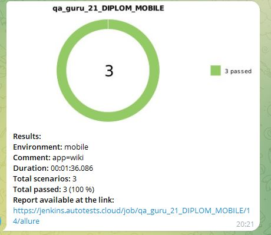

# Автоматизация тестирования мобильного приложения Wikipedia

<p align="center">
<a href="https://github.com/wikimedia/apps-android-wikipedia/releases"></a>
</p>

## Содержание:
+ [Стек технологий](#computer-Стек-технологий)
+ [Тестовые сценарии](#clipboard-Тестовые-сценарии)
+ [Сборка в Jenkins](#-Сборка-в-Jenkins)
+ [Команды запуска тестов в терминале](#desktop_computer-Команды-запуска-тестов-в-терминале)
+ [Интеграция с Allure report](#-Интеграция-с-Allure-report)
+ [Интеграция с Allure TestOps](#-Интеграция-с-Allure-testOps)
+ [Интеграция с Jira](#-Интеграция-с-Jira)
+ [Видео прохождения тестов](#cinema-Видео-прохождения-Тестов)
+ [Интеграция с Appium](#-Интеграция-с-Appium)
+ [Интеграция с Browserstack](#-Интеграция-с-Browserstack)
+ [Информирование в Telegram](#-Информирование-в-Telegram)

## :computer: Стек технологий
<p align="center">
<a href="https://www.java.com/"></a>
<a href="https://github.com/"></a>
<a href="https://www.jetbrains.com/idea/"></a>
<a href="https://gradle.org/"></a>
<a href="https://selenide.org/"></a>
<a href="https://junit.org/junit5/"></a>
<a href="https://aerokube.com/selenoid/"></a>
<a href="https://www.jenkins.io/"></a>
<a href="https://github.com/allure-framework/allure2"></a>
<a href="https://qameta.io/"></a>
<a href="https://appium.io/"></a>
<a href="https://www.browserstack.co"></a>
<a href="https://www.atlassian.com/software/jira"></a>
<a href="https://telegram.org/"></a>
</p>

## :clipboard: Тестовые сценарии
#### Android:
+ :white_check_mark: Проверка поиска "Appium"
+ :white_check_mark: Проверка ошибки открытия результатов поиска "Wikipedia"
+ :white_check_mark: Проверка нажатия кнопки "Меню"
#### iOS
+ :white_check_mark: Проверка ввода "hello@browserstack.com"

#### Local
+ :white_check_mark: Проверка поиска "Wikipedia
+ :white_check_mark: Проверка корректного отображения страниц "Onboarding screen"


##  Сборка в Jenkins
<kbd>[](https://jenkins.autotests.cloud/job/qa_guru_21_DIPLOM_MOBILE/)</kbd>

#### Параметры сборки:
| Параметры | Значение                             |
|:----------|:-------------------------------------|
| TASK      | Способы запуска мобильных автотестов |

<kbd>[](https://jenkins.autotests.cloud/job/qa_guru_21_DIPLOM_MOBILE/build?delay=0sec)</kbd>

## :desktop_computer: Команды запуска тестов в терминале
#### Команды для локального запуска:
```bash
gradle clean local_test -Dhost=local

gradle clean ios_bs_test -Dhost=ios
gradle clean android_bs_test -Dhost=android``
```

#### Команды для удаленного запуска:
```bash
clean ${TASK} -Denv=${TASK}``
```
>${TASK} заменяем на одно из: android, ios, local

##  Интеграция с Allure report
#### Диаграммы прохождения тестов:
<kbd>[](https://jenkins.autotests.cloud/job/qa_guru_21_DIPLOM_MOBILE/14/allure/)</kbd>

#### Развернутый результат прохождения тестов:
| Левая часть скриншота | Правая часть скриншота            |
|:----------------------|:----------------------------------|
| Тестовые сценарии     | Подробное описание шагов          |
|                       | Финальный скриншот каждого теста  |
|                       | Исходники страницы теста          |
|                       | Исходники консоли браузера        |
|                       | Финальный ролик с процессом теста |

<kbd>[](https://jenkins.autotests.cloud/job/qa_guru_21_DIPLOM_MOBILE/14/allure/#suites)</kbd>

##  Интеграция с Allure TestOps
#### Диаграммы прохождения тестов:
<kbd></kbd>

#### Развернутый результат прохождения тестов:
| Левая часть скриншота | Правая часть скриншота            |
|:----------------------|:----------------------------------|
| Тестовые сценарии     | Подробное описание шагов          |
|                       | Финальный скриншот каждого теста  |
|                       | Исходники страницы теста          |
|                       | Исходники консоли браузера        |
|                       | Финальный ролик с процессом теста |

<kbd></kbd>

##  Интеграция с Jira
<kbd></kbd>

## :cinema: Видео прохождения тестов
#### :white_check_mark: Проверка поиска "Appium":
<p align="center">
  
</p>

##  Интеграция с Appium

#### Запуск автотестов на виртуальном смартфоне при помощи Appium Inspector и Android Studio:
<kbd></kbd>

##  Интеграция с Browserstack
#### Детальная инфографика процесса:
<kbd></kbd>

##  Информирование в Telegram
#### Оповещение ведется при помощи Telegram bot API:
<kbd></kbd>